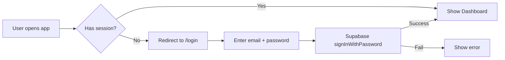
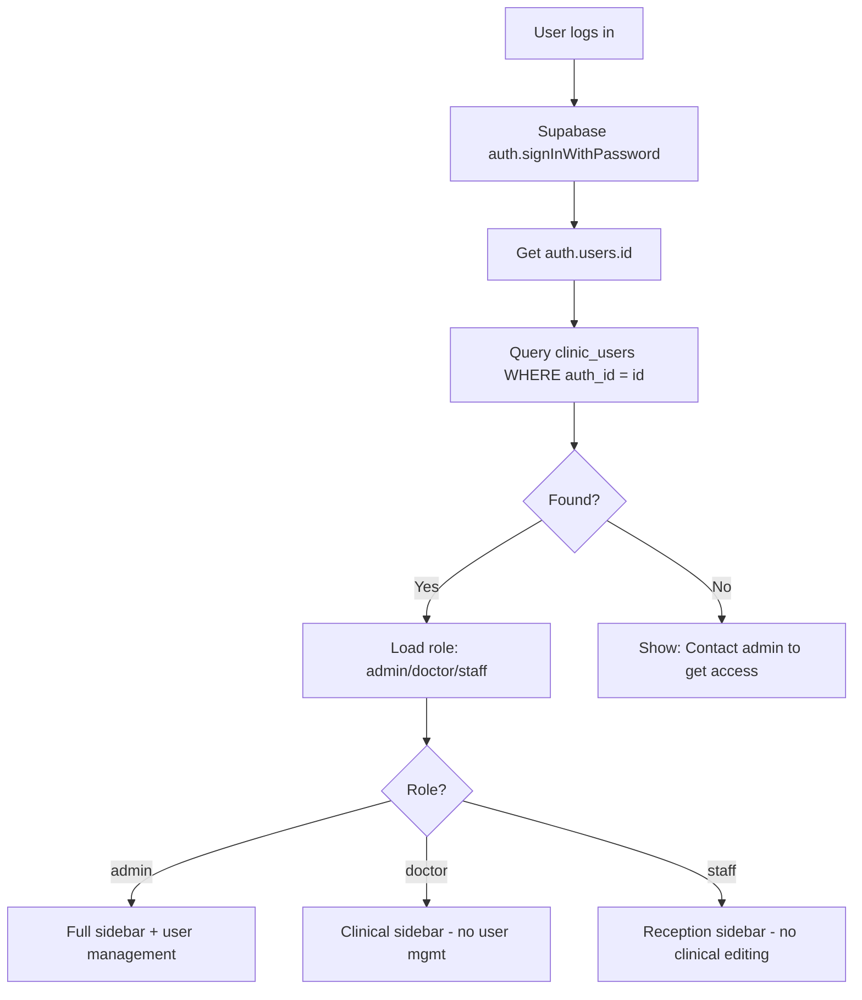
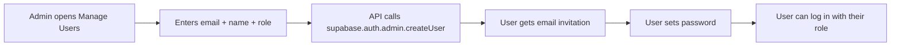
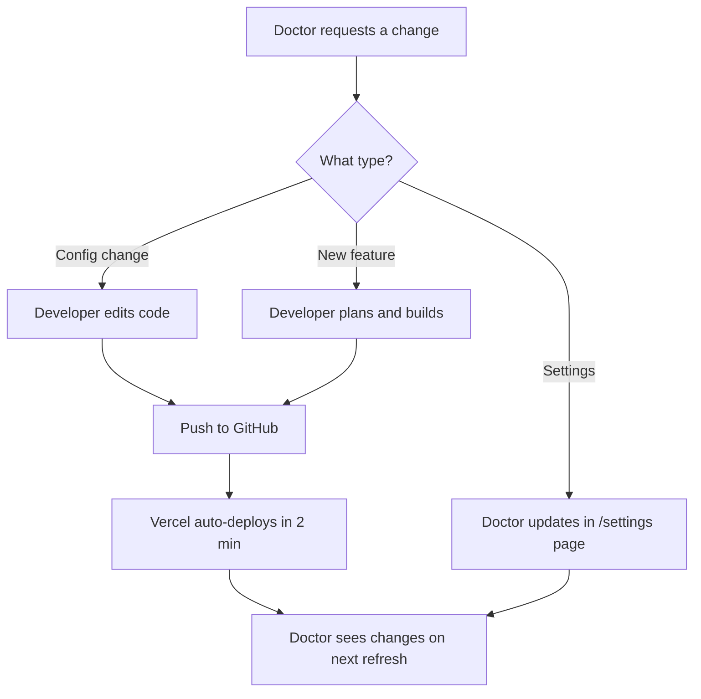

# NexMedicon HMS — Production Readiness Plan
## Login, Roles, Real Clinic Deployment & Customization

---

## 1. Current State Analysis

### What Exists Today

| Component | Current State | Production Ready? |
|-----------|--------------|-------------------|
| **Login** | Supabase email/password auth via `/login` | ⚠️ Partial — works but no roles |
| **Signup** | Manual only — admin creates users in Supabase dashboard | ❌ No self-signup page |
| **Roles** | None — every authenticated user sees everything | ❌ No doctor/staff/admin distinction |
| **Auth Guard** | `AppShell.tsx` checks `supabase.auth.getSession()` | ✅ Works |
| **Settings** | Stored in `localStorage` per browser | ⚠️ Not shared across devices |
| **Patient Data** | Stored in Supabase PostgreSQL with RLS | ✅ Secure, but RLS is wide open |
| **RLS Policies** | `allow_auth_*` — any authenticated user can do everything | ⚠️ Needs tightening |
| **Demo Data** | `seed_demo_data.sql` inserts fake patients | ⚠️ Must NOT run on production |

### Current Login Flow



### Key Gaps for Production

1. **No role system** — a receptionist can see billing reports, a doctor can delete patients
2. **No signup page** — doctor must go to Supabase dashboard to add users
3. **Settings in localStorage** — if doctor logs in from a different device, settings are lost
4. **Demo data mixed with real** — no clean separation
5. **No audit trail** — who changed what, when
6. **No password reset** — user is stuck if they forget password

---

## 2. Proposed Role System

### Three Roles

| Role | Who | Can Do | Cannot Do |
|------|-----|--------|-----------|
| **admin** | Clinic owner / IT person | Everything + manage users + see all reports + change settings | — |
| **doctor** | The treating physician | View/edit patients, consultations, prescriptions, discharge, ANC, labs, beds | Delete patients, manage users, see billing config |
| **staff** | Receptionist / nurse | Register patients, manage queue, billing, bed management, print forms | Edit consultations, write prescriptions, change settings |

### Database Design

```sql
-- New table: clinic_users (links Supabase auth users to roles)
CREATE TABLE clinic_users (
  id          UUID DEFAULT gen_random_uuid() PRIMARY KEY,
  auth_id     UUID NOT NULL UNIQUE,  -- references auth.users.id
  email       TEXT NOT NULL,
  full_name   TEXT NOT NULL,
  role        TEXT NOT NULL CHECK (role IN ('admin', 'doctor', 'staff')),
  is_active   BOOLEAN DEFAULT TRUE,
  created_at  TIMESTAMPTZ DEFAULT NOW(),
  updated_at  TIMESTAMPTZ DEFAULT NOW()
);

-- New table: clinic_settings (replaces localStorage)
CREATE TABLE clinic_settings (
  id          UUID DEFAULT gen_random_uuid() PRIMARY KEY,
  key         TEXT NOT NULL UNIQUE,
  value       TEXT,
  updated_by  UUID REFERENCES clinic_users(id),
  updated_at  TIMESTAMPTZ DEFAULT NOW()
);
```

### How It Works



---

## 3. Signup and User Management Flow

### No Public Signup — Invite Only

For a real clinic, we do NOT want random people signing up. The flow is:

1. **First-time setup**: When the app is deployed, the deployer creates the first admin user in Supabase dashboard
2. **Admin invites others**: Admin goes to `/settings` → "Manage Users" → enters email + name + role → system creates the user
3. **Invited user**: Gets an email with a link to set their password → logs in



### Password Reset

- Add a "Forgot Password?" link on the login page
- Uses Supabase `auth.resetPasswordForEmail()`
- User gets email → clicks link → sets new password

---

## 4. What Happens to Patient Data?

### The Critical Question: Demo vs Production

**Current situation**: The database may have demo/test data from development.

**For a real clinic deployment, here is the strategy**:

#### Option A: Fresh Database (Recommended for first real clinic)

1. Create a **new Supabase project** specifically for the clinic
2. Run all SQL migrations in order (setup → discharge → billing → v5 → v6 → v7 → v8_roles)
3. Do NOT run `seed_demo_data.sql`
4. Create the first admin user
5. Deploy to Vercel with the new Supabase credentials
6. Result: Clean database, zero patients, ready for real data

#### Option B: Clean Existing Database

1. Delete all demo data: `DELETE FROM encounters; DELETE FROM patients; DELETE FROM prescriptions;`
2. Reset MRN sequence: `ALTER SEQUENCE patient_mrn_seq RESTART WITH 1;`
3. Run the new role migration SQL
4. Result: Same database, but clean

### Data Safety Guarantees

| Concern | Solution |
|---------|----------|
| Patient data privacy | Supabase RLS ensures only authenticated clinic staff can access |
| Data backup | Supabase has automatic daily backups (Pro plan) |
| Data loss | PostgreSQL is ACID-compliant; no data loss on crashes |
| HIPAA-like compliance | Data stored in Supabase's SOC2-certified infrastructure |
| Multi-device access | All data is in the cloud — works from any device with login |

---

## 5. How to Update Details Based on Doctor Requirements

### Three Levels of Customization

#### Level 1: Settings Page (Doctor can do themselves)
- Hospital name, address, phone
- Doctor name, qualifications, registration number
- Consultation fees
- UPI ID for payments
- Footer note on prescriptions

**These are already built** — just need to move from localStorage to database.

#### Level 2: Configuration Changes (Admin/Developer)
- Add/remove sidebar menu items
- Change form fields (add new fields to patient registration)
- Modify print layouts
- Add new ward types for beds

**These require code changes** → developer makes changes → pushes to GitHub → Vercel auto-deploys.

#### Level 3: Feature Requests (Developer)
- New modules (e.g., pharmacy inventory, lab integration)
- Custom reports
- Integration with external systems

**These require development work** → plan → code → test → deploy.

### Update Workflow



---

## 6. Production Deployment Checklist

### Step-by-Step for a Real Clinic

```
Phase 1: Setup (One-time)
├── Create new Supabase project for the clinic
├── Run all SQL migrations
├── Create admin user in Supabase Auth
├── Deploy to Vercel with clinic's env vars
├── Configure custom domain (optional: clinic.nexmedicon.com)
└── Test login works

Phase 2: Configuration
├── Admin logs in → goes to /settings
├── Fills in hospital name, doctor details, fees
├── Creates staff accounts (receptionist, nurse)
├── Tests patient registration flow
└── Tests prescription printing

Phase 3: Go Live
├── Train staff on the system (30 min)
├── Print QR code for patient self-registration
├── Start registering real patients
└── Monitor for issues first week

Phase 4: Ongoing
├── Doctor requests changes → developer updates
├── Regular backups (automatic with Supabase)
├── Monthly check: disk usage, performance
└── Feature updates pushed via GitHub
```

---

## 7. Implementation Plan — Files to Create/Modify

### New Files

| File | Purpose |
|------|---------|
| `supabase_v8_roles.sql` | New migration: clinic_users table, clinic_settings table, tightened RLS |
| `src/lib/auth.ts` | Role loading, permission checks, user context |
| `src/app/api/users/route.ts` | API for admin to create/list/update users |
| `src/app/api/users/invite/route.ts` | API to invite new user via Supabase admin |
| `src/components/layout/RoleGuard.tsx` | Component that hides UI based on role |
| `plans/production-deployment-guide.md` | Step-by-step guide for deploying to a real clinic |

### Modified Files

| File | Changes |
|------|---------|
| `src/app/login/page.tsx` | Add "Forgot Password?" link, remove demo button for production |
| `src/components/layout/AppShell.tsx` | Load user role on auth, pass to context |
| `src/components/layout/Sidebar.tsx` | Filter nav items based on role |
| `src/app/settings/page.tsx` | Add "Manage Users" section for admin, move settings to DB |
| `src/lib/settings.ts` | Add DB-backed settings with localStorage fallback |
| `src/lib/supabase.ts` | Add server-side client for admin operations |
| `DEPLOY.md` | Update with production-specific instructions |

---

## 8. Questions for You Before Implementation

Before I start coding, I want to confirm a few things:

1. **First clinic**: Is this for a single doctor's clinic, or will multiple doctors share the system?
2. **Staff count**: How many staff members will use the system? (helps decide if we need a full user management UI or just manual setup)
3. **Custom domain**: Does the doctor want their own URL (e.g., `drclinic.com`) or is `something.vercel.app` fine?
4. **Existing data**: Is there any real patient data already in the current Supabase project, or is it all demo data?
5. **Billing**: Is the Razorpay payment integration needed, or will the clinic handle payments offline?

---

## Summary

The system is architecturally sound and nearly production-ready. The main gaps are:

1. **Role-based access control** — needs a `clinic_users` table and role checks in the UI
2. **User management** — admin needs to invite/manage staff without touching Supabase dashboard
3. **Settings persistence** — move from localStorage to database
4. **Clean data separation** — fresh Supabase project for each clinic
5. **Password reset** — add forgot password flow
6. **Production hardening** — remove demo button, tighten RLS policies

None of these are massive changes. The core HMS functionality (patients, OPD, prescriptions, beds, billing, ANC, labs, discharge) is already built and working.
